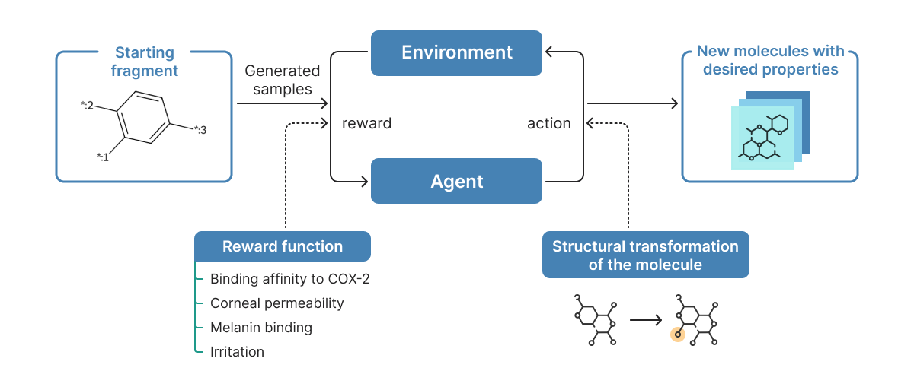

# Deep Reinforcement Learning for *De Novo* Synthesis of eye drops
In this work, for the first time we present a pipeline generating potential active substances in eye drops based on protein-ligand interaction with predefined properties. For that, we trained classical ML models to predict corneal permeability, binding of the drug to melanin and eye irritation. We further constructed a novel reward function to explicitly take into account the desired properties of eye drops. Using our pipeline we generate 1762 unique molecules with improved properties characterizing active substances of eye drops.


---
## Setup Python environment
```
conda env create -f environment.yml
conda activate freedpp
```
We used KAN model for melanin binding prediction. You can install pykan environment from [here](https://github.com/KindXiaoming/pykan)
